# Chapter 6: Architecture - How Firecracker Works 🏗️

> "Understanding the 'why' helps you master the 'how'" - Wise Engineer

## 🎯 The Big Picture

Before we dive into the details, let's understand the overall architecture at a high level.


---

## 🧩 Core Components

Firecracker has several key components working together. Let's explore each one!

### 1. **Firecracker Process** (The Manager)

The Firecracker process is the brains of the operation.


**Key Responsibilities:**
- Listens for API requests
- Configures microVM resources
- Manages microVM lifecycle
- Enforces resource limits
- Provides metadata service

**Written in**: Rust (for safety and performance)

### 2. **KVM** (The Engine)

KVM (Kernel-based Virtual Machine) is the Linux kernel module that makes virtualization possible.


**What KVM Does:**
- Provides hardware virtualization support
- Creates virtual CPUs (vCPUs)
- Manages memory mapping
- Handles CPU instructions from guest

**Analogy**: KVM is like the engine in a car - it provides the power to move, but you need a transmission, wheels, and steering to actually drive.

### 3. **microVM** (The Tiny Computer)

A microVM is a complete virtual machine, but minimal and optimized.


**Characteristics:**
- Minimal: Only what's needed
- Fast: < 125ms startup time
- Secure: Complete isolation
- Ephemeral: Created and destroyed quickly

### 4. **Jailer** (The Security Guard)

The Jailer is a companion process that provides additional security.


**What Jailer Does:**
- Runs Firecracker in a chroot jail
- Applies cgroup resource limits
- Filters system calls (seccomp)
- Provides defense-in-depth security

**Analogy**: If Firecracker is the house, Jailer is the security fence around it.

---

## 🔄 How It All Works Together

Let's trace through what happens when you start a microVM:

### Step 1: Start Firecracker Process

```bash
firecracker --api-sock /tmp/firecracker.sock
```

**What happens:**
1. Firecracker binary starts
2. Opens a Unix domain socket for API communication
3. Waits for configuration requests

### Step 2: Configure the microVM

```bash
curl --unix-socket /tmp/firecracker.sock \
    -X PUT 'http://localhost/boot-source' \
    -d '{"kernel_image_path": "..."}'
```

**What happens:**
1. API request is received
2. Configuration is validated
3. Settings are stored in memory

### Step 3: Start the microVM

```bash
curl --unix-socket /tmp/firecracker.sock \
    -X PUT 'http://localhost/actions' \
    -d '{"action_type": "InstanceStart"}'
```

**What happens:**
1. Firecracker opens `/dev/kvm`
2. Creates a new virtual machine via KVM
3. Allocates vCPUs and memory
4. Loads kernel into guest memory
5. Starts guest vCPUs
6. Guest kernel boots
7. Userspace starts

### Step 4: Run Application

**What happens:**
1. Application runs in guest userspace
2. System calls trap to guest kernel
3. Guest kernel talks to hardware
4. Some operations trap to KVM
5. KVM handles virtualization

### Step 5: Stop the microVM

```bash
curl --unix-socket /tmp/firecracker.sock \
    -X PATCH 'http://localhost/actions' \
    -d '{"action_type": "InstanceStop"}'
```

**What happens:**
1. Firecracker tells guest to shut down
2. vCPUs are stopped
3. Memory is freed
4. Resources are released

---

## 🎯 Key Design Principles

Firecracker follows several important design principles:

### 1. **Minimalism** 🎯

**Only what's needed, nothing more**

| Traditional VM | Firecracker microVM |
|---------------|---------------------|
| 20+ devices    | 5 devices           |
| Full BIOS      | No BIOS             |
| Legacy support | None                |
| Complex boot   | Simple boot         |

**Benefit**: Smaller attack surface, faster startup

### 2. **Security First** 🔒

**Layers of defense**


### 3. **Fast Startup** ⚡

**Optimized for speed**

| Optimization | Impact |
|-------------|--------|
| No BIOS | Saves 100ms+ |
| Minimal kernel | Fast boot |
| No hardware probe | Saves 50ms+ |
| Pre-built configs | No detection |
| **Total** | **< 125ms** |

### 4. **High Density** 📦

**Pack thousands on one machine**


### 5. **API-First Control** 🔌

**Everything via RESTful API**


---

## 🔬 Deep Dive: Virtual Machine Creation

Let's look at what actually happens when a microVM is created:

```mermaid
graph TB
    S1["1. Firecracker opens /dev/kvm<br/>└─ KVM_CREATE_VM ioctl<br/>&nbsp;&nbsp;&nbsp;└─ Creates VM file descriptor"]
    S2["2. Allocate memory for guest<br/>└─ mmap anonymous memory<br/>&nbsp;&nbsp;&nbsp;└─ Size: mem_size_mib"]
    S3["3. Create vCPUs<br/>└─ KVM_CREATE_VCPU ioctl (for each vCPU)<br/>&nbsp;&nbsp;&nbsp;└─ Creates vCPU file descriptor"]
    S4["4. Map guest memory<br/>└─ KVM_SET_USER_MEMORY_REGION ioctl<br/>&nbsp;&nbsp;&nbsp;└─ Maps memory into KVM"]
    S5["5. Load kernel into guest memory<br/>└─ Read kernel file<br/>&nbsp;&nbsp;&nbsp;└─ Copy to guest memory at 0x100000"]
    S6["6. Set vCPU registers<br/>└─ KVM_SET_REGS ioctl<br/>&nbsp;&nbsp;&nbsp;└─ Set RIP to kernel entry"]
    S7["7. Run guest<br/>└─ KVM_RUN ioctl<br/>&nbsp;&nbsp;&nbsp;└─ Guest CPU starts executing!"]
    S8["8. Guest boots<br/>└─ Kernel initializes<br/>└─ Hardware discovery<br/>└─ Mount rootfs<br/>└─ Start init process"]
    
    S1 --> S2
    S2 --> S3
    S3 --> S4
    S4 --> S5
    S5 --> S6
    S6 --> S7
    S7 --> S8
```



---

## 📊 Resource Usage Comparison

### Memory Overhead

| Component | Regular VM | Container | Firecracker |
|-----------|-----------|-----------|-------------|
| Base Memory | 1-2 GB | 10-50 MB | **5 MB** |
| Per-instance | ~100 MB | ~20 MB | **~5 MB** |
| 100 instances | ~10 GB | ~2 GB | **~500 MB** |

### Startup Time

| Phase | Regular VM | Firecracker |
|-------|-----------|-------------|
| BIOS/UEFI | 2-3 seconds | 0 ms (none) |
| Bootloader | 1-2 seconds | 0 ms (none) |
| Kernel boot | 5-10 seconds | ~50 ms |
| Init process | 2-5 seconds | ~50 ms |
| **Total** | **10-20 seconds** | **< 125 ms** |

### Throughput

| Metric | Regular VM | Firecracker |
|--------|-----------|-------------|
| Boot rate | ~1/minute | **150/second** |
| Max per host | ~10 | **1000s** |
| Cold start | 10-30s | **< 125ms** |

---

## 🎯 Summary: The Architecture in One Sentence

> Firecracker is a **Rust-based VMM** that uses **KVM** to create **minimal virtual machines** with **fast startup** and **strong security**, controlled via a **RESTful API**.

---

## 🧠 Test Your Understanding

### Quick Quiz:

1. **What is KVM's role?**
   - A) The API server
   - B) The hardware virtualization layer
   - C) The security guard
   - D) The filesystem

   <details>
   <summary>Answer</summary>
   **B) The hardware virtualization layer**
   </details>

2. **What makes Firecracker microVMs start so fast?**
   - A) Faster CPU
   - B) No BIOS, minimal kernel
   - C) More memory
   - D) Magic

   <details>
   <summary>Answer</summary>
   **B) No BIOS, minimal kernel**
   </details>

3. **What does the Jailer do?**
   - A) Starts the VM
   - B) Provides additional security
   - C) Manages networking
   - D) Loads the kernel

   <details>
   <summary>Answer</summary>
   **B) Provides additional security**
   </details>

4. **How many devices does Firecracker emulate?**
   - A) 1
   - B) 5
   - C) 20
   - D) 100

   <details>
   <summary>Answer</summary>
   **B) 5** (virtio-net, virtio-block, virtio-vsock, serial console, keyboard controller)
   </details>

---

## 🚀 Next Steps

Now that you understand the architecture:

1. **Explore the API**: Learn how to control Firecracker programmatically
2. **Advanced Configuration**: Try different settings and optimizations
3. **Production Use**: Learn best practices for running Firecracker in production
4. **Contribute**: Join the Firecracker community!

[Continue to Chapter 7: Key Concepts →](./07-key-concepts.md)

---

*Want to see the actual code? Check out the [Firecracker GitHub repository](https://github.com/firecracker-microvm/firecracker)*
