# Chapter 7: Key Concepts - Understanding the Fundamentals 🧠

> "The beautiful thing about learning is that no one can take it away from you" - B.B. King

## 🎯 Overview

In this chapter, we'll explore the key concepts that make Firecracker work. Understanding these will help you use Firecracker effectively and troubleshoot issues.

---

## 🔑 Concept 1: Virtualization

### What is Virtualization?

**Virtualization** is the ability to create a virtual (rather than actual) version of something, including virtual computer hardware platforms, storage devices, and computer network resources.


### Types of Virtualization

#### 1. **Hardware Virtualization** (What Firecracker Uses)

The CPU itself supports virtualization:


**Key Points:**
- Guest OS has no idea it's virtualized
- Complete isolation between guests
- Near-native performance

#### 2. **OS-level Virtualization** (Containers)


**Key Points:**
- All containers share the kernel
- Less isolation than hardware virtualization
- Faster and lighter weight

### Why Firecracker Uses Hardware Virtualization

| Aspect | Containers | Hardware Virtualization (Firecracker) |
|--------|-----------|--------------------------------------|
| Isolation | Process-level | Complete (hardware) |
| Security | Good (kernel bugs affect all) | Excellent (separate kernels) |
| Kernel | Shared | Separate per VM |
| Use Case | Trusted workloads | Multi-tenant, untrusted code |

---

## 🔑 Concept 2: Host vs. Guest

Understanding the difference between host and guest is crucial.

### Host (The Physical Machine)

The **host** is the physical computer running Linux with KVM.


**Characteristics:**
- Has direct access to hardware
- Runs the hypervisor (Firecracker)
- Manages all resources

### Guest (The Virtual Machine)

The **guest** is the virtual machine running inside Firecracker.


**Characteristics:**
- Thinks it has real hardware
- Has its own kernel
- Isolated from other guests

### The Relationship


---

## 🔑 Concept 3: The Firecracker API

Firecracker is controlled entirely through a RESTful API over a Unix domain socket.

### Why RESTful API?

**Benefits:**
- Language-agnostic (any language can use it)
- Standard HTTP methods (GET, PUT, PATCH)
- JSON format (easy to parse)
- Familiar to web developers

### API Structure

```mermaid
graph TB
    Socket["Unix Socket<br/>/tmp/firecracker.sock"]
    
    Socket --> GET1["GET /machine-config<br/>→ Get configuration"]
    Socket --> PUT1["PUT /machine-config<br/>→ Set vCPUs, memory"]
    Socket --> GET2["GET /boot-source<br/>→ Get kernel info"]
    Socket --> PUT2["PUT /boot-source<br/>→ Set kernel path"]
    Socket --> GET3["GET /drives/rootfs<br/>→ Get disk info"]
    Socket --> PUT3["PUT /drives/rootfs<br/>→ Set disk image"]
    Socket --> PUT4["PUT /actions<br/>→ Start/Stop/Pause"]
    Socket --> GET4["GET /info<br/>→ Get VM info"]
```



### Example API Calls

#### Configure Machine

```bash
curl --unix-socket /tmp/firecracker.sock \
    -X PUT 'http://localhost/machine-config' \
    -H 'Content-Type: application/json' \
    -d '{
        "vcpu_count": 2,
        "mem_size_mib": 512,
        "ht_enabled": false
    }'
```

#### Start VM

```bash
curl --unix-socket /tmp/firecracker.sock \
    -X PUT 'http://localhost/actions' \
    -H 'Content-Type: application/json' \
    -d '{"action_type": "InstanceStart"}'
```

#### Get Info

```bash
curl --unix-socket /tmp/firecracker.sock \
    -X GET 'http://localhost/info'
```

---

## 🔑 Concept 4: Device Model

Firecracker uses a **minimal device model** - it only emulates 5 devices!

### Why Minimal Device Model?

| Traditional VM | Firecracker microVM |
|---------------|---------------------|
| 20+ devices | 5 devices |
| Complex boot | Simple boot |
| Larger attack surface | Smaller attack surface |
| Slower startup | Fast startup |

### The 5 Devices

#### 1. **virtio-net** (Network)


**What it does:** Provides network connectivity

**Configuration:**
```json
{
  "iface_id": "eth0",
  "guest_mac": "02:FC:00:00:00:01",
  "host_dev_name": "tap0"
}
```

#### 2. **virtio-block** (Storage)

```
Guest                          Host
  │                             │
  │  virtio-blk driver          │
  │       │                     │
  │       ▼                     │
  │  Virtual Block Device       │
  │       │                     │
  └───────┼─────────────────────┘
          │
    /path/to/rootfs.ext4
```

**What it does:** Provides disk storage

**Configuration:**
```json
{
  "drive_id": "rootfs",
  "path_on_host": "./rootfs.ext4",
  "is_root_device": true,
  "is_read_only": false
}
```

#### 3. **virtio-vsock** (Socket Communication)

```
Guest                          Host
  │                             │
  │  vsock driver               │
  │       │                     │
  │       ▼                     │
  │  Virtual Socket             │
  │       │                     │
  └───────┼─────────────────────┘
          │
    bidirectional communication
```

**What it does:** Allows host-guest communication

**Use Cases:**
- Debugging
- Logging
- File transfer
- Metadata service

#### 4. **Serial Console** (Terminal)

```
Guest                          Host
  │                             │
  │  /dev/ttyS0                 │
  │       │                     │
  │       ▼                     │
  │  Serial Port                │
  │       │                     │
  └───────┼─────────────────────┘
          │
    stdin/stdout/stderr
```

**What it does:** Provides console access

**Use Case:** Boot messages, login prompt

#### 5. **Minimal Keyboard Controller** (Power Button)

```
Guest
  │
  │  i8042 controller
  │       │
  │       ▼
  │  Power Button
  │
  └─→ Triggers shutdown
```

**What it does:** Allows graceful shutdown

**Use Case:** ACPI poweroff

### Virtio: The Magic Behind the Devices

All these devices use **virtio** (virtual I/O) - a standard for paravirtualized devices.

```
Traditional Emulation         Virtio (Paravirtualization)
─────────────────            ┌─────────────────┐
│  Emulated NIC  │            │  Virtio-net     │
│  (slow, fake   │            │  (fast, shared  │
│   hardware)    │            │   memory)       │
└─────────────────┘            └─────────────────┘
     Slow                              Fast!
```

**How it works:**
1. Guest and host share memory
2. Data transferred via queues
3. No hardware emulation needed
4. Near-native performance

---

## 🔑 Concept 5: Rate Limiting

Firecracker has **built-in rate limiters** for network and storage I/O.

### Why Rate Limiting?

When running 1000s of microVMs on one host:
- One VM could use all bandwidth
- One VM could slow down others
- Need fair resource allocation

### Network Rate Limiting

```
Network Interface
    │
    ├─ Token Bucket Algorithm
    │   ├─ Bandwidth limit (e.g., 100 MB/s)
    │   └─ Burst allowance (e.g., 10 MB)
    │
    └─ Throttles traffic
        ├─ TCP
        ├─ UDP
        └─ Any protocol
```

**Example Configuration:**
```json
{
  "iface_id": "eth0",
  "rate_limiter": {
    "bandwidth": {
      "size": 100000000,
      "refill_time": 1000
    }
  }
}
```

### Storage I/O Rate Limiting

```
Block Device
    │
    ├─ Token Bucket Algorithm
    │   ├─ Ops limit (e.g., 1000 IOPS)
    │   └─ Bytes limit (e.g., 50 MB/s)
    │
    └─ Throttles I/O
        ├─ Reads
        └─ Writes
```

**Example Configuration:**
```json
{
  "drive_id": "rootfs",
  "rate_limiter": {
    "bandwidth": {
      "size": 50000000,
      "refill_time": 1000
    },
    "ops": {
      "size": 1000,
      "refill_time": 1000
    }
  }
}
```

### Token Bucket Algorithm (Simplified)

```
Bucket Size: 100 tokens
Refill Rate: 10 tokens/second

Time: 0s    [████████████████████████] 100 tokens
Time: 1s    [███████████████████████▒▒] 90 tokens
Time: 2s    [██████████████████████▒▒▒] 80 tokens
              (refilled to 90, used 10)

Request: Needs 20 tokens
Time: 3s    [█████████████████████▒▒▒▒] 70 tokens
              (refilled to 80, used 10, denied 10)
              → Request throttled!
```

---

## 🔑 Concept 6: Metadata Service

The metadata service allows sharing configuration between host and guest.

### What is It?

A simple HTTP service running inside Firecracker that the guest can query.

```
Guest                   Firecracker              Host
  │                         │                     │
  ├─ HTTP GET →            │                     │
  │  http://169.254.169.254│                     │
  │                         │                     │
  │                         ├─ Look up metadata  │
  │                         │                     │
  │                         ◄─ Return data ───────┤
  │                         │                     │
  ◄─ JSON response ─────────┤                     │
  │                         │                     │
```

### Use Cases

- SSH keys
- Network configuration
- Instance ID
- User data (startup scripts)
- Tags/labels

### Example Metadata

```json
{
  "instanceId": "i-123456789",
  "localHostname": "microvm-01",
  "publicKeys": ["ssh-rsa AAAA..."],
  "userData": "#!/bin/bash\napt-get update"
}
```

---

## 🧪 Putting It All Together

### Real-World Example: AWS Lambda

When you call a Lambda function:

1. **API Gateway** receives your request
2. **Lambda Service** checks for a warm microVM
3. **If none exists:**
   - Firecracker creates a new microVM (125ms!)
   - Configures vCPUs, memory, network
   - Loads your function code
   - Starts the microVM
4. **Jailer** applies security limits
5. **Your function** runs in the microVM
6. **Rate limiters** ensure fairness
7. **Metadata service** provides configuration
8. **Function returns** results
9. **MicroVM** stays warm (for next invocation) or is destroyed

All of this happens in **milliseconds**!

---

## 📊 Comparison Summary

| Concept | Traditional VM | Container | Firecracker |
|---------|---------------|-----------|-------------|
| **Virtualization** | Hardware | OS-level | Hardware |
| **Kernel** | Separate | Shared | Separate |
| **Devices** | 20+ | Host devices | 5 (virtio) |
| **API** | Multiple tools | Docker API | RESTful |
| **Rate Limiting** | External (cgroups) | External (cgroups) | Built-in |
| **Metadata** | Cloud-init | Various | Built-in service |

---

## 🎯 Key Takeaways

1. **Hardware Virtualization** provides complete isolation
2. **Host vs Guest** distinction is crucial
3. **RESTful API** makes Firecracker language-agnostic
4. **Minimal Device Model** enables fast startup
5. **Rate Limiting** ensures fair resource usage
6. **Metadata Service** enables host-guest communication

---

## 🧠 Test Your Knowledge

### Questions:

1. **Why does Firecracker use hardware virtualization instead of containers?**
   - For better performance
   - For stronger isolation
   - For smaller size
   - All of the above

2. **What is virtio?**
   - A type of virtual CPU
   - A paravirtualized I/O framework
   - A programming language
   - A type of filesystem

3. **How many devices does Firecracker emulate?**
   - 1
   - 5
   - 10
   - 20

4. **What is the purpose of rate limiting?**
   - To make things slower
   - To ensure fair resource allocation
   - To save money
   - To improve security

5. **How does the guest communicate with the host?**
   - Network sockets
   - Virtio-vsock
   - Shared memory
   - All of the above

<details>
<summary>Answers</summary>

1. **For stronger isolation** (containers share the kernel, microVMs don't)
2. **A paravirtualized I/O framework** (enables fast I/O)
3. **5** (virtio-net, virtio-block, virtio-vsock, serial, keyboard)
4. **To ensure fair resource allocation** (prevent one VM from hogging resources)
5. **All of the above** (network, vsock, and shared memory are all used)

</details>

---

## 🚀 What's Next?

You now understand the core concepts! Next, we'll look at:

- Advanced configuration options
- Best practices for production
- Performance optimization
- Troubleshooting common issues

[Continue to Chapter 8: Advanced Topics →](./08-advanced-topics.md)

---

*Want to learn more? Check out the [Firecracker specification](https://github.com/firecracker-microvm/firecracker/blob/main/docs/microVM.md)*
