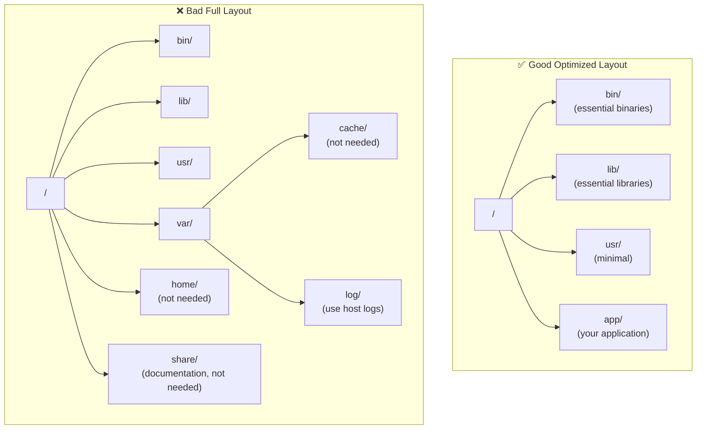

# Chapter 9: Best Practices - Using Firecracker Like a Pro 🏆

> "Practice makes perfect, but perfect practice makes champions" - Anonymous Pro

## 🎯 Overview

This chapter covers best practices for using Firecracker in production and development.

---

## 🔒 Security Best Practices

### 1. Always Use the Jailer in Production

The Jailer provides additional security layers:

```bash
# ✅ Good: Use Jailer
jailer \
    --id=${MICROVM_ID} \
    --exec-file=/usr/local/bin/firecracker \
    --uid 1000 \
    --gid 1000 \
    --chroot-base-dir=/srv/jailer

# ❌ Bad: Run Firecracker directly
firecracker --api-sock /tmp/firecracker.sock
```

**Why?**
- Runs Firecracker as non-root
- chroot isolation
- cgroup resource limits
- seccomp system call filtering

### 2. Isolate microVMs Properly

Use proper network isolation:

```bash
# ✅ Good: Separate bridge per tenant
sudo ip link add name tenant1-bridge type bridge
sudo ip link add name tenant2-bridge type bridge

# ❌ Bad: All microVMs on same network
sudo ip link add name bridge type bridge
```

### 3. Limit Resources Appropriately

Set appropriate resource limits:

```bash
# ✅ Good: Reasonable limits
{
  "vcpu_count": 2,
  "mem_size_mib": 512,
  "rate_limiter": {
    "bandwidth": {"size": 100000000, "refill_time": 1000}
  }
}

# ❌ Bad: No limits
{
  "vcpu_count": 0,    # Unlimited
  "mem_size_mib": 0,  # Unlimited
}
```

### 4. Use Read-Only Filesystems When Possible

Prevent modifications:

```bash
# ✅ Good: Read-only root filesystem
{
  "drive_id": "rootfs",
  "path_on_host": "./rootfs.ext4",
  "is_root_device": true,
  "is_read_only": true
}

# ❌ Bad: Writable root filesystem
{
  "drive_id": "rootfs",
  "path_on_host": "./rootfs.ext4",
  "is_root_device": true,
  "is_read_only": false
}
```

**When to use writable:**
- Application needs to write files
- Databases
- Logs (though logs should go to host via vsock)

### 5. Keep Firecracker Updated

Always run the latest version:

```bash
# Check for updates
curl -s https://api.github.com/repos/firecracker-microvm/firecracker/releases/latest | grep "tag_name"

# Subscribe to security advisories
# https://github.com/firecracker-microvm/firecracker/security/advisories
```

---

## ⚡ Performance Best Practices

### 1. Optimize Kernel Size

Use minimal kernels:

```bash
# ✅ Good: Minimal kernel
wget https://s3.amazonaws.com/spec.ccfc.min/img/quickstart_guide/xenial-generic-linux-4.14.gz
# Size: ~5 MB

# ❌ Bad: Full kernel
# Size: ~20+ MB, slower boot
```

### 2. Use Proper CPU Templates

Choose the right CPU template:

```bash
# ✅ Good: v2 template (predictable performance)
{"cpu_template": "v2"}

# ❌ Bad: No template (performance variations)
{"cpu_template": null}
```

**CPU Templates:**
- `v2`: Predictable performance (most cloud providers)
- `v3`: Better performance, slight variations
- `None`: Host CPU passthrough (not recommended for production)

### 3. Pre-Warm microVMs

Keep a pool of warm microVMs:

```python
# ✅ Good: Pre-create microVMs
class MicroVMPool:
    def __init__(self, pool_size=10):
        self.pool = [self.create_microvm() for _ in range(pool_size)]
    
    def get_microvm(self):
        return self.pool.pop() if self.pool else self.create_microvm()
    
    def return_microvm(self, microvm):
        self.pool.append(microvm)

# ❌ Bad: Create on demand (slower)
def handle_request(request):
    microvm = create_microvm()  # Takes 125ms!
    return microvm.run(request)
```

### 4. Use Rate Limiting

Prevent noisy neighbors:

```bash
# ✅ Good: Set rate limits
{
  "rate_limiter": {
    "bandwidth": {"size": 100000000, "refill_time": 1000}
  }
}

# ❌ Bad: No rate limits (one VM can hog resources)
{
  "rate_limiter": null
}
```

### 5. Optimize Filesystem Layout

Organize filesystem for speed:



---

## 📊 Monitoring Best Practices

### 1. Enable Metrics

Always enable metrics collection:

```bash
# ✅ Good: Enable metrics
firecracker \
    --api-sock /tmp/firecracker.sock \
    --metrics-path /var/log/firecracker-metrics.json

# ❌ Bad: No metrics
firecracker --api-sock /tmp/firecracker.sock
```

### 2. Centralize Logs

Send logs to centralized logging:

```bash
# ✅ Good: Log to file + syslog
firecracker \
    --log-path /var/log/firecracker.log \
    --level Info

# Forward to syslog or cloud logging
tail -f /var/log/firecracker.log | logger -t firecracker

# ❌ Bad: Log to stdout only
firecracker --api-sock /tmp/firecracker.sock
```

### 3. Monitor Resource Usage

Track per-microVM resource usage:

```python
# ✅ Good: Monitor each microVM
def track_resources(microvm_id):
    metrics = read_metrics(microvm_id)
    return {
        'cpu_usage': metrics['vmm']['cpu_usage'],
        'memory': metrics['vmm']['memory_overhead'],
        'disk_reads': metrics['block']['read_count'],
        'network_bytes': metrics['net']['rx_bytes']
    }

# ❌ Bad: No monitoring
```

### 4. Set Up Alerts

Alert on important events:

```yaml
# ✅ Good: Alert on failures
alerts:
  - name: MicroVMMemoryHigh
    condition: memory > 1GB
    action: notify_admins
  
  - name: MicroVMStartFailed
    condition: start_failures > 5
    action: page_oncall

# ❌ Bad: No alerts (discover issues when users complain)
```

---

## 🏗️ Architecture Best Practices

### 1. Separate Control Plane from Data Plane

```
✅ Good Architecture:
Control Plane (API Server)
    │
    ├─→ Host 1 (Data Plane)
    │   ├─ microVM #1
    │   ├─ microVM #2
    │   └─ microVM #3
    │
    ├─→ Host 2 (Data Plane)
    │   ├─ microVM #4
    │   └─ microVM #5
    │
    └─→ Host 3 (Data Plane)
        ├─ microVM #6
        └─ microVM #7

❌ Bad Architecture:
Single Host
    ├─ Control + Data on same machine
    ├─ All microVMs in one place
    └─ Single point of failure
```

### 2. Use Load Balancing

Distribute traffic across microVMs:

```python
# ✅ Good: Load balance
def handle_request(request):
    microvm = load_balancer.get_least_loaded()
    return microvm.run(request)

# ❌ Bad: Always use first available
def handle_request(request):
    microvm = microvms[0]  # Always same one!
    return microvm.run(request)
```

### 3. Design for Statelessness

Make microVMs stateless:

```python
# ✅ Good: State in external storage
def run_function(event):
    # Load state from database
    state = db.get_state(event.user_id)
    result = process(event, state)
    # Save state back
    db.save_state(event.user_id, result)
    return result

# ❌ Bad: State in microVM
def run_function(event):
    # State lost when microVM dies!
    global state
    if not state:
        state = load_state()
    return process(event, state)
```

### 4. Implement Graceful Shutdown

Handle shutdowns properly:

```python
# ✅ Good: Graceful shutdown
def shutdown_microvm(microvm):
    # Send SIGTERM to application
    microvm.send_signal(signal.SIGTERM)
    # Wait for graceful shutdown
    microvm.wait(timeout=10)
    # Force kill if needed
    if microvm.is_alive():
        microvm.destroy()

# ❌ Bad: Immediate kill
def shutdown_microvm(microvm):
    microvm.destroy()  # Data loss!
```

---

## 🧪 Development Best Practices

### 1. Use Version Control

Track everything:

```bash
# ✅ Good: Version control
git init firecracker-configs
git add templates/
git add scripts/
git commit -m "Add microVM templates"

# ❌ Bad: No version control
# Just run commands manually
```

### 2. Create Reusable Templates

Don't repeat yourself:

```bash
# ✅ Good: Template-based
cat > templates/web-server.json <<EOF
{
  "vcpu_count": 2,
  "mem_size_mib": 512,
  "boot_args": "console=ttyS0 reboot=k panic=1 pci=off"
}
EOF

# Use template
curl --unix-socket $FC_SOCKET -X PUT \
    'http://localhost/machine-config' \
    -d @templates/web-server.json

# ❌ Bad: Hardcoded values
curl --unix-socket $FC_SOCKET -X PUT \
    'http://localhost/machine-config' \
    -d '{"vcpu_count": 2, "mem_size_mib": 512, ...}'
```

### 3. Automate Everything

Use scripts and automation:

```bash
# ✅ Good: Automated deployment
#!/bin/bash
./scripts/create-network.sh
./scripts/start-microvms.sh
./scripts/run-tests.sh
./scripts/teardown.sh

# ❌ Bad: Manual steps
# (Remember to create network...)
# (Then start microVMs...)
# (Don't forget to configure...)
```

### 4. Test Thoroughly

Have good test coverage:

```python
# ✅ Good: Automated tests
def test_microvm_creation():
    microvm = create_microvm()
    assert microvm.is_running()
    assert microvm.cpu_count() == 2
    microvm.destroy()

def test_network_connectivity():
    microvm = create_microvm()
    assert microvm.ping("8.8.8.8")
    microvm.destroy()

# ❌ Bad: No tests
# Just deploy and hope for the best
```

---

## 🚀 Production Checklist

Before deploying to production:

### Security
- [ ] Using Jailer for all microVMs
- [ ] Read-only root filesystems where possible
- [ ] Proper network isolation
- [ ] Rate limiting enabled
- [ ] Resource limits set
- [ ] Regular security updates
- [ ] Audit logging enabled

### Performance
- [ ] Optimized kernel size
- [ ] CPU templates configured
- [ ] Filesystem optimized
- [ ] Pre-warming implemented
- [ ] Load balancing configured
- [ ] Resource monitoring in place

### Reliability
- [ ] High availability setup
- [ ] Graceful shutdown handling
- [ ] Automatic restart on failure
- [ ] Health checks configured
- [ ] Backup strategy
- [ ] Disaster recovery plan

### Observability
- [ ] Metrics collection enabled
- [ ] Centralized logging
- [ ] Distributed tracing
- [ ] Alerting configured
- [ ] Dashboards created
- [ ] Runbooks documented

### Documentation
- [ ] Architecture documented
- [ ] Configuration documented
- [ ] Runbooks created
- [ ] On-call procedures
- [ ] Known issues documented
- [ ] Contact information

---

## 📈 Scaling Strategy

### Vertical Scaling (Bigger Hosts)

```
Current: 16 GB RAM, 8 CPUs
Scale to: 64 GB RAM, 32 CPUs

Result: 4x more microVMs per host
```

**When to use:**
- Fewer hosts to manage
- Simplified networking
- Better resource utilization

### Horizontal Scaling (More Hosts)

```
Current: 1 host
Scale to: 10 hosts

Result: 10x capacity, more redundancy
```

**When to use:**
- Better fault tolerance
- Geographic distribution
- Easier maintenance (can take hosts offline)

### Auto-scaling

```python
# Auto-scale based on demand
def auto_scale():
    current_load = get_current_load()
    available_capacity = get_available_capacity()
    
    if current_load > 0.8 and available_capacity < 0.2:
        # Need more capacity
        add_hosts(count=2)
    elif current_load < 0.2 and available_capacity > 0.8:
        # Too much capacity
        remove_hosts(count=1)
```

---

## 🎯 Common Mistakes to Avoid

### 1. Over-Allocation

```bash
# ❌ Don't allocate more than you have
{
  "vcpu_count": 32,  # Host only has 8 CPUs!
  "mem_size_mib": 16384  # Host only has 8 GB RAM!
}

# ✅ Be realistic
{
  "vcpu_count": 2,
  "mem_size_mib": 512
}
```

### 2. No Resource Limits

```bash
# ❌ No limits = problems
{
  "rate_limiter": null  # One VM can use all bandwidth!
}

# ✅ Set reasonable limits
{
  "rate_limiter": {
    "bandwidth": {"size": 100000000, "refill_time": 1000}
  }
}
```

### 3. Ignoring Logs

```bash
# ❌ Logs go to /dev/null
firecracker --api-sock /tmp/firecracker.sock

# ✅ Capture logs
firecracker \
    --api-sock /tmp/firecracker.sock \
    --log-path /var/log/firecracker.log \
    --level Info
```

### 4. Hardcoded Paths

```bash
# ❌ Hard to change
/path/to/my/special/directory/config.json

# ✅ Use environment variables
${MICROVM_CONFIG_DIR}/config.json
```

---

## ✅ Summary

### Key Takeaways:

1. 🔒 **Security**: Always use Jailer in production
2. ⚡ **Performance**: Optimize kernels, use templates, pre-warm
3. 📊 **Monitoring**: Enable metrics and logs
4. 🏗️ **Architecture**: Separate control/data planes, use load balancing
5. 🧪 **Development**: Version control, automation, testing
6. 🚀 **Production**: Use the checklist!

### Remember:

- Start small and scale
- Monitor everything
- Plan for failures
- Document your setups
- Keep learning

---

## 🚀 Next Steps

Now that you know best practices, let's look at troubleshooting:

[Continue to Chapter 10: Troubleshooting →](./10-troubleshooting.md)

---

*Following these practices will help you run Firecracker successfully in production!*
